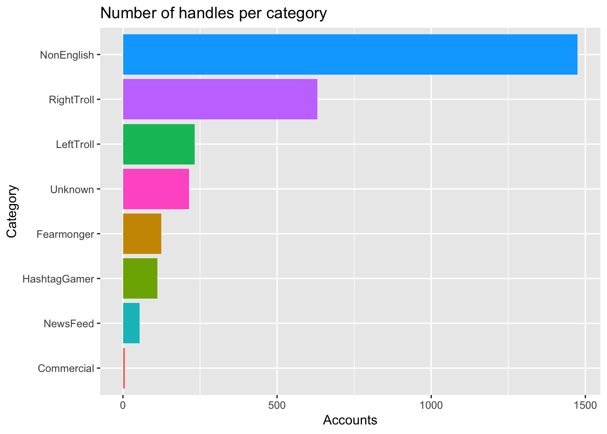
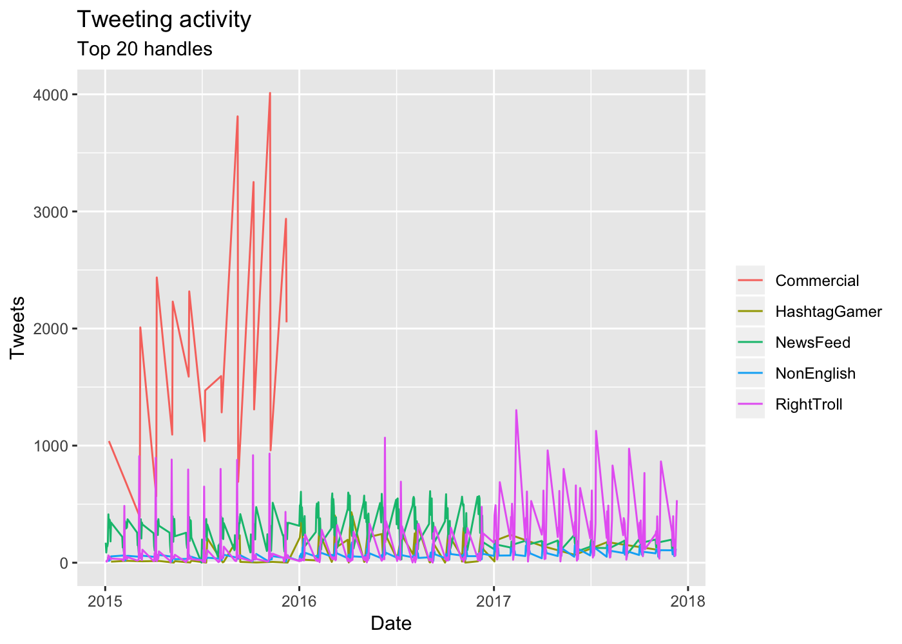
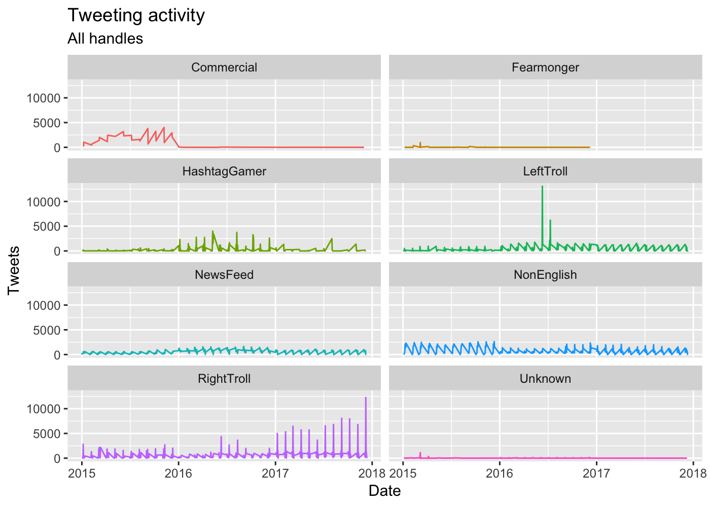
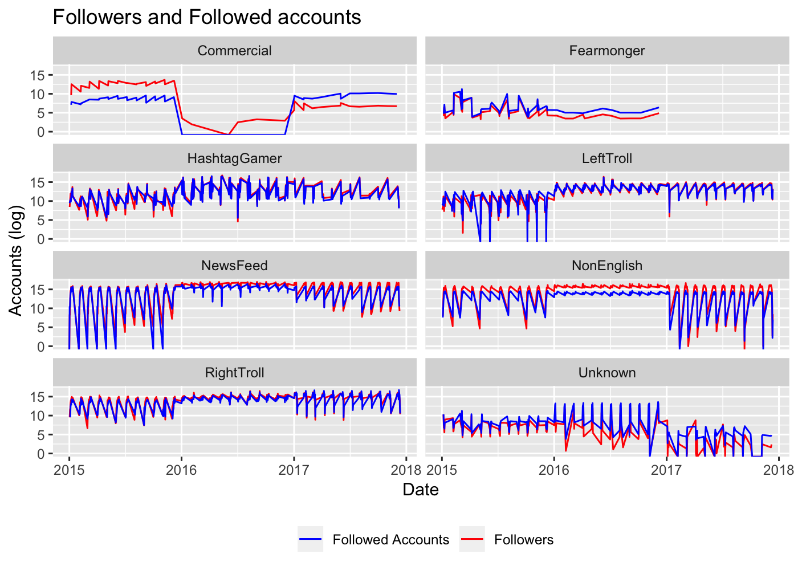

TidyTuesday Week 20 - Russian Troll Tweets
================
Roberto Preste
2018-08-14

``` r
library(tidyverse)
```

    ## ── Attaching packages ────────────────────────────────────────────────────────────────────────────── tidyverse 1.2.1 ──

    ## ✔ ggplot2 3.0.0     ✔ purrr   0.2.5
    ## ✔ tibble  1.4.2     ✔ dplyr   0.7.5
    ## ✔ tidyr   0.8.1     ✔ stringr 1.3.1
    ## ✔ readr   1.1.1     ✔ forcats 0.3.0

    ## ── Conflicts ───────────────────────────────────────────────────────────────────────────────── tidyverse_conflicts() ──
    ## ✖ dplyr::filter() masks stats::filter()
    ## ✖ dplyr::lag()    masks stats::lag()

``` r
library(lubridate)
```

    ## 
    ## Attaching package: 'lubridate'

    ## The following object is masked from 'package:base':
    ## 
    ##     date

------------------------------------------------------------------------

The original data are available on fivethirtyeight's [GitHub](https://github.com/fivethirtyeight/russian-troll-tweets) and are detailed in a specific [article](https://fivethirtyeight.com/features/why-were-sharing-3-million-russian-troll-tweets/).

``` r
tweet_1 <- read_csv("russian-troll-tweets/IRAhandle_tweets_1.csv", col_types = "ccccccciiicciic")
tweet_2 <- read_csv("russian-troll-tweets/IRAhandle_tweets_2.csv", col_types = "ccccccciiicciic") # issues
tweet_3 <- read_csv("russian-troll-tweets/IRAhandle_tweets_3.csv", col_types = "ccccccciiicciic")
tweet_4 <- read_csv("russian-troll-tweets/IRAhandle_tweets_4.csv", col_types = "ccccccciiicciic")
tweet_5 <- read_csv("russian-troll-tweets/IRAhandle_tweets_5.csv", col_types = "ccccccciiicciic")
tweet_6 <- read_csv("russian-troll-tweets/IRAhandle_tweets_6.csv", col_types = "ccccccciiicciic") # issues
tweet_7 <- read_csv("russian-troll-tweets/IRAhandle_tweets_7.csv", col_types = "ccccccciiicciic")
tweet_8 <- read_csv("russian-troll-tweets/IRAhandle_tweets_8.csv", col_types = "ccccccciiicciic") # issues
tweet_9 <- read_csv("russian-troll-tweets/IRAhandle_tweets_9.csv", col_types = "ccccccciiicciic") # issues
```

Let's merge all the dataset together.

``` r
tweets <- bind_rows(list(tweet_1, tweet_2, tweet_3, tweet_4, tweet_5, tweet_6, tweet_7, tweet_8, tweet_9))
```

------------------------------------------------------------------------

Data exploration
----------------

First of all, let's find the top 20 tweeters and distinguish them based on their assigned account category.

``` r
top_20_handles <- tweets %>% 
    group_by(author, account_category) %>% 
    summarise(n = n()) %>% 
    arrange(desc(n)) 
top_20_handles <- top_20_handles[1:20, ]
```

``` r
top_20_handles %>% 
    ggplot(aes(x = reorder(author, n), y = n)) + 
    geom_col(aes(fill = account_category)) + 
    coord_flip() + 
    labs(x = "Authors", y = "Tweets", title = "Top 20 tweeters", fill = "Category: ") + 
    theme(legend.position = "bottom")
```


The top tweeters are commercial, (fake) news feeds and Right trolls.

However, even though these are the most active account categories, we can see that the first two groups represent only a small part of the total IRA handles.

``` r
categ_count <- tweets %>% 
    select(author, account_category) %>% 
    distinct() %>% 
    group_by(account_category) %>% 
    summarise(n = n())
```

``` r
categ_count %>% 
    ggplot(aes(x = reorder(account_category, n), y = n)) + 
    geom_col(aes(fill = account_category)) + 
    coord_flip() + 
    labs(x = "Category", y = "Accounts", title = "Number of handles per category") + 
    # theme(legend.position = "bottom")
    guides(fill = FALSE)
```



We might want to know the tweeting frequency of these top 20 accounts, to check if there is some tweeting trend.

``` r
top_tweets <- tweets %>% 
    filter(author %in% top_20_handles$author) %>% 
    separate(col = publish_date, into = c("pub_date", "pub_time"), sep = " ") %>% 
    mutate(pub_date = as_date(pub_date, tz = "UTC", format = "%d/%m/%Y"))
```

``` r
top_tweets_grouped <- top_tweets %>% 
    group_by(pub_date, account_category) %>% 
    summarise(n = n()) %>% 
    filter(!is.na(pub_date))
```

``` r
top_tweets_grouped %>% 
    ggplot(aes(x = pub_date, y = n)) + 
    geom_line(aes(color = account_category)) + 
    labs(x = "Date", y = "Tweets", color = "", title = "Tweeting activity", subtitle = "Top 20 handles")
```



From this plot we can see that, among the top 20 tweeters, the commercial ones posted a number of tweets 4 times greater than the other categories, but suddenly stopped tweeting right before 2016.
Let's check if this is true taking into account all handles, not just the top 20.

``` r
tweets_dates <- tweets %>% 
    separate(col = publish_date, into = c("pub_date", "pub_time"), sep = " ") %>% 
    mutate(pub_date = as_date(pub_date, tz = "UTC", format = "%d/%m/%Y"))
```

``` r
tweets_dates_grouped <- tweets_dates %>% 
    filter(pub_date >= "2015/01/01", pub_date <= "2018/01/01") %>% 
    group_by(pub_date, account_category) %>% 
    summarise(n = n()) %>% 
    filter(!is.na(pub_date))
```

``` r
tweets_dates_grouped %>% 
    ggplot(aes(x = pub_date, y = n)) + 
    geom_line(aes(color = account_category)) + 
    labs(x = "Date", y = "Tweets", title = "Tweeting activity", subtitle = "All handles") + 
    facet_wrap(~ account_category, nrow = 4) + 
    guides(color = FALSE)
```



What we found previously might hold true concerning commercial tweeters: their number of tweets suddenly drops since 2016. However, we can also discover some more interesting insights:
\* fearmonger accounts (those spreading fake crisis news) seem to disappear right before 2017 (luckily, I would add);
\* Left trolls had a peak in their activity in mid 2016: I'm no expert in American politics, but this seem to overlap with the Democrats presidential primaries;
\* Right trolls, although having a fairly constant tweeting rate initially, seem to show some sort of exponential increase starting from the first months of 2016;
\* all the other categories do not show any particular trend.
In addition, almost all categories have an almost identical monthly trend in tweets.

Let's see how the number of followers and followed accounts changed for each of these categories over time.

``` r
tweets_foll_grouped <- tweets_dates %>% 
    filter(pub_date >= "2015/01/01", pub_date <= "2018/01/01") %>% 
    group_by(pub_date, account_category) %>% 
    summarise(followers = sum(followers), following = sum(following)) %>% 
    filter(!is.na(pub_date))
```

``` r
tweets_foll_grouped %>% 
    ggplot(aes(x = pub_date)) + 
    geom_line(aes(y = log(followers), color = "red")) + 
    geom_line(aes(y = log(following), color = "blue")) + 
    labs(x = "Date", y = "Accounts (log)", title = "Followers and Followed accounts") + 
    facet_wrap(~ account_category, nrow = 4) + 
    scale_colour_manual(name = "", values = c("red" = "red", "blue" = "blue"), labels = c("Followed Accounts", "Followers")) + 
    theme(legend.position = "bottom")
```



The log transformation allows to better appreciate fluctuations in these numbers. The number of followers and followed accounts is mostly equal within each category; however, particular trends can be found characterizing 2015, 2016 and 2017, with 2016 being the year with less variation in these numbers, among all categories.

------------------------------------------------------------------------

### Disclaimer

These are just some basic insights, created for simple data exploration and visualization purposes. Furthermore, some of the results shown come from filtering the data to some extent.
No conclusions should be drawn from what is reported here; more appropriate analysis are being conducted by more qualified people than me, like [Darren Linvill](https://www.clemson.edu/cbshs/faculty-staff/profiles/darrenl) and [Patrick Warren](http://pwarren.people.clemson.edu/) and you should get in touch with them if interested in these data.

All in all, this was an interesting dataset to work with and I'm keen to come back to it in the future, to explore it more deeply with some text and sentiment analysis techniques.

------------------------------------------------------------------------

``` r
sessionInfo()
```

    ## R version 3.5.0 (2018-04-23)
    ## Platform: x86_64-apple-darwin15.6.0 (64-bit)
    ## Running under: macOS High Sierra 10.13.6
    ## 
    ## Matrix products: default
    ## BLAS: /Library/Frameworks/R.framework/Versions/3.5/Resources/lib/libRblas.0.dylib
    ## LAPACK: /Library/Frameworks/R.framework/Versions/3.5/Resources/lib/libRlapack.dylib
    ## 
    ## locale:
    ## [1] en_GB.UTF-8/en_GB.UTF-8/en_GB.UTF-8/C/en_GB.UTF-8/en_GB.UTF-8
    ## 
    ## attached base packages:
    ## [1] stats     graphics  grDevices utils     datasets  methods   base     
    ## 
    ## other attached packages:
    ##  [1] bindrcpp_0.2.2  lubridate_1.7.4 forcats_0.3.0   stringr_1.3.1  
    ##  [5] dplyr_0.7.5     purrr_0.2.5     readr_1.1.1     tidyr_0.8.1    
    ##  [9] tibble_1.4.2    ggplot2_3.0.0   tidyverse_1.2.1
    ## 
    ## loaded via a namespace (and not attached):
    ##  [1] Rcpp_0.12.17     cellranger_1.1.0 pillar_1.2.3     compiler_3.5.0  
    ##  [5] plyr_1.8.4       bindr_0.1.1      tools_3.5.0      digest_0.6.15   
    ##  [9] jsonlite_1.5     evaluate_0.10.1  nlme_3.1-137     gtable_0.2.0    
    ## [13] lattice_0.20-35  pkgconfig_2.0.1  rlang_0.2.1      psych_1.8.4     
    ## [17] cli_1.0.0        rstudioapi_0.7   yaml_2.1.19      parallel_3.5.0  
    ## [21] haven_1.1.1      withr_2.1.2      xml2_1.2.0       httr_1.3.1      
    ## [25] knitr_1.20       hms_0.4.2        rprojroot_1.3-2  grid_3.5.0      
    ## [29] tidyselect_0.2.4 glue_1.2.0       R6_2.2.2         readxl_1.1.0    
    ## [33] foreign_0.8-70   rmarkdown_1.10   modelr_0.1.2     reshape2_1.4.3  
    ## [37] magrittr_1.5     backports_1.1.2  scales_0.5.0     htmltools_0.3.6 
    ## [41] rvest_0.3.2      assertthat_0.2.0 mnormt_1.5-5     colorspace_1.3-2
    ## [45] labeling_0.3     stringi_1.2.3    lazyeval_0.2.1   munsell_0.5.0   
    ## [49] broom_0.4.4      crayon_1.3.4
