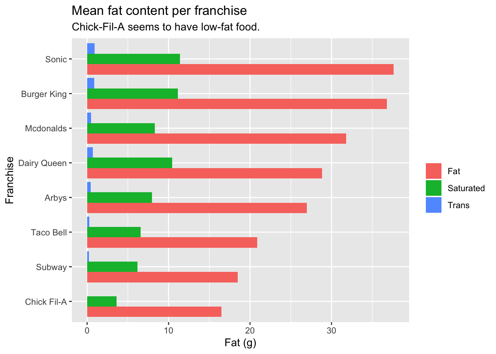
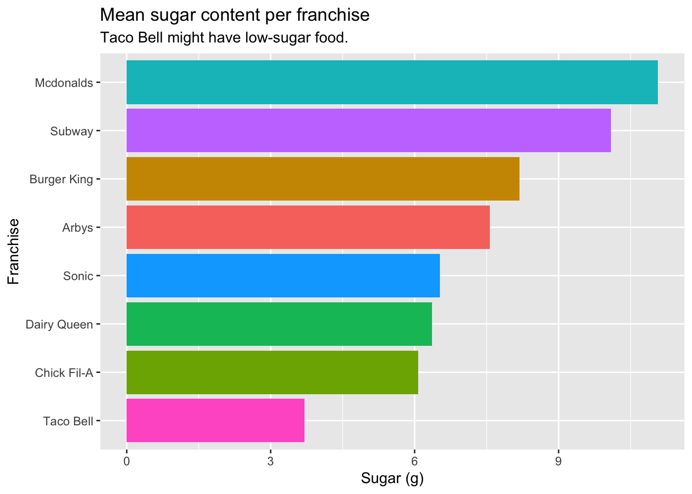
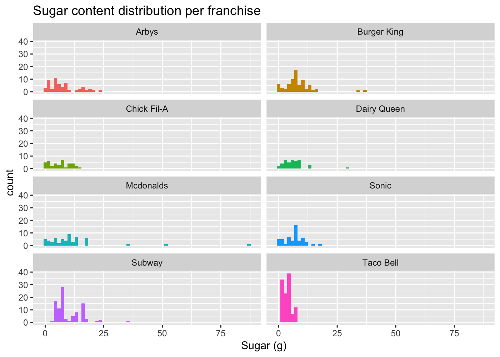
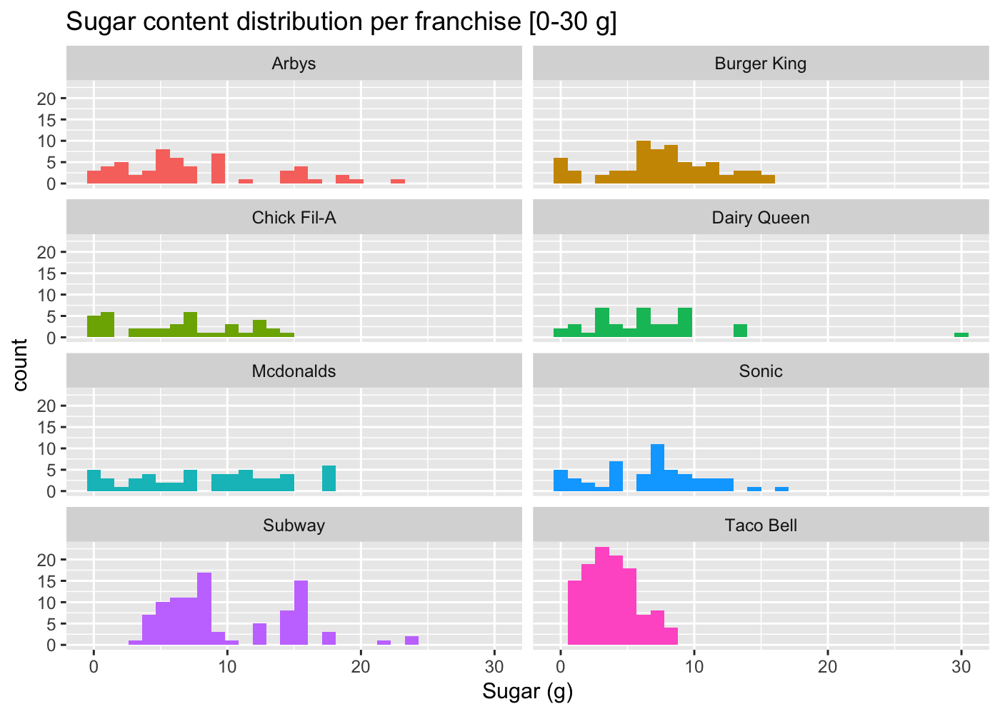

TidyTuesday Week 23 - Fast Food Calories
================
Roberto Preste
2018-09-04

``` r
library(tidyverse)
library(stringr)
library(magrittr)
library(rvest)
library(skimr)
```

------------------------------------------------------------------------

Original data come from [fastfoodnutrition.org](https://fastfoodnutrition.org), and the original article about fast food calories comparison is available on [Franchise Opportunities](https://www.franchiseopportunities.com/blog/general-franchise-information/fast-food-calorie-comparison-charts).

Firstly, we need to scrape the data from the data source (function kindly provided by [thomas\_mock](https://twitter.com/thomas_mock)), then we can combine all the data and save them.

``` r
food_scrape <- function(restaurant, tbl_sel){
    url <- glue::glue("https://fastfoodnutrition.org/{restaurant}/chart")
    url %>% 
        read_html() %>% 
        html_table() %>% 
        .[tbl_sel] %>% 
        bind_rows() %>% 
        select(-X16) %>%
        set_names(nm = c("item", "calories", "cal_fat", "total_fat", "sat_fat", "trans_fat",
                         "cholesterol", "sodium", "total_carb", "fiber", "sugar", "protein",
                         "vit_a", "vit_c", "calcium")) %>% 
        mutate(restaurant = str_replace(restaurant, "-", " "),
               restaurant = str_to_title(restaurant)) # save restaurant name
} 
```

``` r
mcd_df <- food_scrape("mcdonalds", c(1,2,3,9,19))
cfa_df <- food_scrape("chick-fil-a", c(1,2,8,13))
sonic_df <- food_scrape("sonic", c(1,2,17,18,20))
arbys_df <- food_scrape("arbys", c(1:4,8))
bk_df <- food_scrape("burger-king", c(1:3,7,11:12))
dq_df <- food_scrape("dairy-queen", c(5, 7, 12, 25, 27))
sub_df <- food_scrape("subway", c(1,2,3,4,5,6,7,8,9))
taco_df <- food_scrape("taco-bell", c(1,2,3,4,5,15,18,19,20,22,23,24))

final_df <- bind_rows(mcd_df, cfa_df, sonic_df, arbys_df, bk_df, dq_df, sub_df, taco_df) %>% 
    select(restaurant, everything()) %>% 
    mutate(salad = case_when(str_detect(item, "salad") ~ "Salad",
                             TRUE ~ "Other"))

final_df %>% write_csv("data/fastfood_calories.csv")
```

The final dataframe is available in `data/fastfood_calories.csv`.
It contains nutritional information about entrees (main courses) from the specified fast foot franchises.

``` r
df <- read_csv("data/fastfood_calories.csv")
```

    ## Parsed with column specification:
    ## cols(
    ##   restaurant = col_character(),
    ##   item = col_character(),
    ##   calories = col_integer(),
    ##   cal_fat = col_integer(),
    ##   total_fat = col_integer(),
    ##   sat_fat = col_double(),
    ##   trans_fat = col_double(),
    ##   cholesterol = col_integer(),
    ##   sodium = col_integer(),
    ##   total_carb = col_integer(),
    ##   fiber = col_integer(),
    ##   sugar = col_integer(),
    ##   protein = col_integer(),
    ##   vit_a = col_integer(),
    ##   vit_c = col_integer(),
    ##   calcium = col_integer(),
    ##   salad = col_character()
    ## )

------------------------------------------------------------------------

Data exploration
----------------

Let's have a quick view at the data.

``` r
head(df)
```

    ## # A tibble: 6 x 17
    ##   restaurant item  calories cal_fat total_fat sat_fat trans_fat cholesterol
    ##   <chr>      <chr>    <int>   <int>     <int>   <dbl>     <dbl>       <int>
    ## 1 Mcdonalds  Arti…      380      60         7       2       0            95
    ## 2 Mcdonalds  Sing…      840     410        45      17       1.5         130
    ## 3 Mcdonalds  Doub…     1130     600        67      27       3           220
    ## 4 Mcdonalds  Gril…      750     280        31      10       0.5         155
    ## 5 Mcdonalds  Cris…      920     410        45      12       0.5         120
    ## 6 Mcdonalds  Big …      540     250        28      10       1            80
    ## # ... with 9 more variables: sodium <int>, total_carb <int>, fiber <int>,
    ## #   sugar <int>, protein <int>, vit_a <int>, vit_c <int>, calcium <int>,
    ## #   salad <chr>

``` r
skim(df)
```

    ## Skim summary statistics
    ##  n obs: 527 
    ##  n variables: 17 
    ## 
    ## ── Variable type:character ─────────────────────────────────────────────────────────────────────────────
    ##    variable missing complete   n min max empty n_unique
    ##        item       0      527 527   5  63     0      517
    ##  restaurant       0      527 527   5  11     0        8
    ##       salad       0      527 527   5   5     0        1
    ## 
    ## ── Variable type:integer ───────────────────────────────────────────────────────────────────────────────
    ##     variable missing complete   n    mean     sd p0   p25  p50     p75
    ##      cal_fat       0      527 527  236.91 164.84  0 123    207  310   
    ##      calcium     208      319 527   24.43  25.05  0   8     20   30   
    ##     calories       0      527 527  527.27 279.88 20 330    480  680   
    ##  cholesterol       0      527 527   72.29  62.6   0  35     60   90   
    ##        fiber      16      511 527    4.17   3.02  0   2      3    5   
    ##      protein       1      526 527   27.92  17.53  1  16     25   35.75
    ##       sodium       0      527 527 1233.47 684.46 15 795   1100 1540   
    ##        sugar       0      527 527    7.33   6.71  0   3.5    6    9   
    ##   total_carb       0      527 527   45.27  24.68  0  28     44   56   
    ##    total_fat       0      527 527   26.38  18.24  0  14     23   34   
    ##        vit_a     224      303 527   20.32  36.07  0   4     10   20   
    ##        vit_c     208      319 527   22.08  31.57  0   4     10   40   
    ##  p100     hist
    ##  1270 ▆▇▃▁▁▁▁▁
    ##   290 ▇▂▁▁▁▁▁▁
    ##  2430 ▅▇▃▁▁▁▁▁
    ##   805 ▇▁▁▁▁▁▁▁
    ##    17 ▇▇▃▂▂▁▁▁
    ##   186 ▇▇▁▁▁▁▁▁
    ##  6080 ▃▇▃▁▁▁▁▁
    ##    87 ▇▂▁▁▁▁▁▁
    ##   156 ▃▆▇▃▂▁▁▁
    ##   141 ▆▇▃▁▁▁▁▁
    ##   250 ▇▁▁▁▁▁▁▁
    ##   400 ▇▁▁▁▁▁▁▁
    ## 
    ## ── Variable type:numeric ───────────────────────────────────────────────────────────────────────────────
    ##   variable missing complete   n mean   sd p0 p25 p50 p75 p100     hist
    ##    sat_fat       0      527 527 8.02 6.36  0   4   7  10   47 ▇▇▂▁▁▁▁▁
    ##  trans_fat       0      527 527 0.45 0.83  0   0   0   1    8 ▇▁▁▁▁▁▁▁

We can drop the `salad` feature, because it has the same value (`Other`) for all the observations in the data, so it's uninformative.

``` r
df %<>% select(-salad)
```

------------------------------------------------------------------------

Visualization
-------------

I chose to focus just on a couple of nutrients from these data, namely some of the most *feared* ones: fat and sugar.

### Fat content per franchise

Let's visualize the general fat content of entrees per franchise, distinguished in total grams of fat, saturated fat and trans fat.

``` r
fat_content <- df %>% 
    group_by(restaurant) %>% 
    summarise(Fat = mean(total_fat), 
              Saturated = mean(sat_fat), 
              Trans = mean(trans_fat)) %>% 
    gather(measure, value, Fat:Trans)
```

``` r
fat_content %>% 
    ggplot(aes(x = reorder(restaurant, value))) + 
    geom_col(aes(y = value, fill = measure), position = "dodge") +
    coord_flip() + 
    labs(x = "Franchise", y = "Fat (g)", title = "Mean fat content per franchise", fill = "", subtitle = "Chick-Fil-A seems to have low-fat food.") 
```



Seems like, in general, Chick-Fil-A might offer food with a lower fat content, with Subway and Taco Bell immediately following. Choosing one of these three franchises can be two to three times an healthier options compared to other fast foods.

### Sugar content per franchise

Another bad player for our health is sugar, so let's check how well our fast foods behave.

``` r
sugar_content <- df %>% 
    group_by(restaurant) %>% 
    summarise(Sugar = mean(sugar))
```

``` r
sugar_content %>% 
    ggplot(aes(x = reorder(restaurant, Sugar), y = Sugar, fill = restaurant)) + 
    geom_col() + 
    coord_flip() + 
    labs(x = "Franchise", y = "Sugar (g)", title = "Mean sugar content per franchise", subtitle = "Taco Bell might have low-sugar food.") + 
    guides(fill = FALSE)
```



A histogram can give a better overview of data and show possible outliers, represented by food with extremely high content of sugar.

``` r
df %>% 
    ggplot(aes(x = sugar, fill = restaurant)) + 
    geom_histogram(bins = 60) + 
    facet_wrap(~ restaurant, nrow = 4, ncol = 2) + 
    labs(x = "Sugar (g)", title = "Sugar content distribution per franchise") +
    guides(fill = FALSE)
```



Let's zoom in a bit and remove the above-mentioned outliers.

``` r
df %>% 
    filter(sugar <= 30) %>% 
    ggplot(aes(x = sugar, fill = restaurant)) + 
    geom_histogram(bins = 30) + 
    facet_wrap(~ restaurant, nrow = 4, ncol = 2) + 
    labs(x = "Sugar (g)", title = "Sugar content distribution per franchise [0-30 g]") +
    guides(fill = FALSE)
```



An interesting feature can be noted here: Taco Bell offers food with the lowest sugar content, not exceeding 9 grams, while other franchises span a wide range of sugar content. Nonetheless, seems like Taco Bell, together with Subway, do not offer sugar-free options as other fast foods do.

------------------------------------------------------------------------

### Disclaimer

These are just some basic insights, created for simple data exploration and visualization purposes. I'm not a nutritionist, and these are not comprehensive data from which any useful and trustworthy information can be extracted.
No conclusions should be drawn from what is reported here.

------------------------------------------------------------------------

``` r
sessionInfo()
```

    ## R version 3.5.1 (2018-07-02)
    ## Platform: x86_64-apple-darwin15.6.0 (64-bit)
    ## Running under: macOS High Sierra 10.13.6
    ## 
    ## Matrix products: default
    ## BLAS: /Library/Frameworks/R.framework/Versions/3.5/Resources/lib/libRblas.0.dylib
    ## LAPACK: /Library/Frameworks/R.framework/Versions/3.5/Resources/lib/libRlapack.dylib
    ## 
    ## locale:
    ## [1] en_GB.UTF-8/en_GB.UTF-8/en_GB.UTF-8/C/en_GB.UTF-8/en_GB.UTF-8
    ## 
    ## attached base packages:
    ## [1] stats     graphics  grDevices utils     datasets  methods   base     
    ## 
    ## other attached packages:
    ##  [1] bindrcpp_0.2.2  skimr_1.0.3     rvest_0.3.2     xml2_1.2.0     
    ##  [5] magrittr_1.5    forcats_0.3.0   stringr_1.3.1   dplyr_0.7.6    
    ##  [9] purrr_0.2.5     readr_1.1.1     tidyr_0.8.1     tibble_1.4.2   
    ## [13] ggplot2_3.0.0   tidyverse_1.2.1
    ## 
    ## loaded via a namespace (and not attached):
    ##  [1] tidyselect_0.2.4 haven_1.1.2      lattice_0.20-35  colorspace_1.3-2
    ##  [5] htmltools_0.3.6  yaml_2.2.0       utf8_1.1.4       rlang_0.2.1     
    ##  [9] pillar_1.3.0     glue_1.3.0       withr_2.1.2      selectr_0.4-1   
    ## [13] modelr_0.1.2     readxl_1.1.0     bindr_0.1.1      plyr_1.8.4      
    ## [17] munsell_0.5.0    gtable_0.2.0     cellranger_1.1.0 evaluate_0.11   
    ## [21] labeling_0.3     knitr_1.20       curl_3.2         fansi_0.3.0     
    ## [25] broom_0.5.0      Rcpp_0.12.18     scales_1.0.0     backports_1.1.2 
    ## [29] jsonlite_1.5     hms_0.4.2        digest_0.6.15    stringi_1.2.4   
    ## [33] grid_3.5.1       rprojroot_1.3-2  cli_1.0.0        tools_3.5.1     
    ## [37] lazyeval_0.2.1   crayon_1.3.4     pkgconfig_2.0.1  lubridate_1.7.4 
    ## [41] assertthat_0.2.0 rmarkdown_1.10   httr_1.3.1       rstudioapi_0.7  
    ## [45] R6_2.2.2         nlme_3.1-137     compiler_3.5.1
